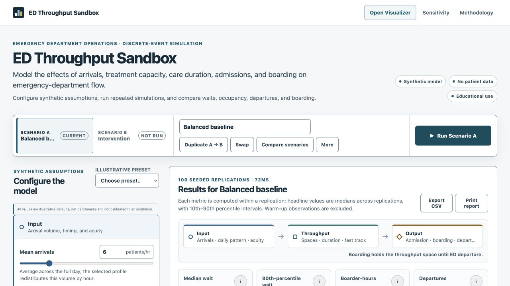

# ED Throughput Sandbox

> An interactive, browser-based discrete-event simulation for exploring emergency-department flow, capacity, and boarding scenarios.

[Live demo](https://ALEXKDOT.github.io/ed-throughput-sandbox/) · [Model specification](./docs/MODEL.md) · [Validation plan](./docs/VALIDATION.md) · [Owner guide](./docs/OWNER_GUIDE.md)



ED Throughput Sandbox is a static, client-side educational application for testing operational hypotheses in a simplified emergency-department flow model. Users can change synthetic demand, acuity, capacity, treatment duration, admission, boarding, and fast-track assumptions; run repeated seeded simulations; and compare scenarios with uncertainty. No patient data, backend, accounts, telemetry, or institution-specific calibration are used.

## What it can do

- Organize assumptions around the **input–throughput–output** framework for ED crowding.
- Run a stochastic, event-driven simulation in a Web Worker with a 24-hour warm-up and 24-hour analysis period.
- Repeat 20–200 deterministic-seed replications and report medians with 10th–90th percentile intervals.
- Preserve treatment-space occupancy while admitted synthetic patients are boarding.
- Compare Scenario A and B with common random numbers and within-replication deltas.
- Model an optional low-acuity fast track whose spaces are reallocated from total ED capacity.
- Save assumptions locally, encode both scenarios in a shareable URL, and import/export validated JSON.
- Export summary and time-series results as CSV and print a report view.
- Sweep one parameter across up to seven distinct valid values in a one-at-a-time sensitivity explorer.
- Explain every major assumption, event rule, distribution, source boundary, and limitation.

## Model at a glance

| Domain         | Synthetic inputs                                                                           | Model role                                                                                        |
| -------------- | ------------------------------------------------------------------------------------------ | ------------------------------------------------------------------------------------------------- |
| **Input**      | Mean arrivals, hourly profile, three-tier acuity mix                                       | Creates a piecewise-constant nonhomogeneous Poisson arrival stream and strict-priority/FIFO queue |
| **Throughput** | Total spaces, tier treatment medians, duration variability, optional fast-track allocation | Determines eligible treatment resources and truncated-lognormal service durations                 |
| **Output**     | Tier admission probabilities, median boarding duration                                     | Determines whether a patient departs after treatment or retains the same ED space while boarding  |

Simultaneous events are processed deterministically: boarding completions, treatment completions, arrivals, then one exhaustive dispatch. The simulator never preempts treatment, models clinical deterioration, or separates clinicians, diagnostics, inpatient beds, transport, environmental services, or specialty placement. Read [docs/MODEL.md](./docs/MODEL.md) for the normative contract.

## Run locally

Requirements: Node.js 24.15 or newer within the Node 24 release line, plus npm.

```bash
npm ci
npm run dev
```

The development server prints the local URL. All simulation work occurs in the browser.

## Development commands

| Command                 | Purpose                                                           |
| ----------------------- | ----------------------------------------------------------------- |
| `npm run dev`           | Start the Vite development server                                 |
| `npm run build`         | Type-check and create the production bundle                       |
| `npm run preview`       | Preview the production bundle locally                             |
| `npm run format:check`  | Verify formatting                                                 |
| `npm run lint`          | Run ESLint with zero warnings allowed                             |
| `npm run typecheck`     | Run strict TypeScript checks                                      |
| `npm test`              | Run deterministic, invariant, property, aggregation, and UI tests |
| `npm run test:coverage` | Generate unit-test coverage                                       |
| `npm run test:e2e`      | Run desktop, mobile, tablet, and wide Playwright workflows        |
| `npm run check`         | Run the full non-browser quality gate                             |

Install the pinned browser runtime once before local end-to-end testing:

```bash
npm run test:e2e:install
```

## Testing and validation

The committed suite covers exact PRNG and duration-transform vectors, zero-arrival and known-event fixtures, resource limits, fast-track eligibility, strict priority/FIFO behavior, boarding occupancy, warm-up boundaries, same-seed reproducibility, paired comparisons, hostile imports, portability, CSV safety, property-generated capacities, and responsive workflows.

Passing software tests establishes implementation conformance—not empirical validity. The model has not been calibrated or validated against a real ED. See [docs/VALIDATION.md](./docs/VALIDATION.md) for release gates and [docs/QA.md](./docs/QA.md) for actual commands and results from the latest audited build.

## Deployment

The application is designed for GitHub Pages. The deployment workflow in [`.github/workflows/deploy-pages.yml`](./.github/workflows/deploy-pages.yml) builds the project-site base path and publishes `dist/` only after the full code-quality and responsive Chromium gates pass on `main`.

To deploy a fork:

1. Update the repository, site, and citation metadata for the fork owner.
2. In the GitHub repository, open **Settings → Pages** and set **Source** to **GitHub Actions**.
3. Push to `main` or manually run the **Deploy GitHub Pages** workflow.
4. Verify the root URL, a URL containing shared scenario state, and the mobile layout.

No runtime API keys or environment secrets are required.

## Documentation

- [Model specification](./docs/MODEL.md): event logic, distributions, metrics, CRN, defaults, and limitations.
- [Sources](./docs/SOURCES.md): verified citations and claim-by-claim support boundaries.
- [Design system](./docs/DESIGN.md): information architecture, responsive rules, accessibility, and visual language.
- [Decision log](./docs/DECISIONS.md): consequential product and engineering choices.
- [Validation plan](./docs/VALIDATION.md): deterministic fixtures, invariants, and release gates.
- [QA record](./docs/QA.md): commands, environments, findings, fixes, and remaining issues.
- [Portfolio language](./docs/PORTFOLIO.md): accurate descriptions, résumé bullets, and interview answers.
- [Owner guide](./docs/OWNER_GUIDE.md): the concepts needed to explain and extend the project honestly.

## Limitations

- Defaults and presets are illustrative synthetic assumptions, not hospital benchmarks.
- This is not a validated forecasting model, patient-care tool, staffing recommender, or crowding score.
- Strict priority can produce prolonged low-acuity waits under severe overload.
- Treatment time combines many operational steps that are not separately represented.
- Boarding is an aggregate output constraint; the inpatient bed system is not modeled.
- Monte Carlo intervals describe simulation variation under chosen assumptions, not predictive uncertainty for a real ED.
- One-at-a-time sensitivity analysis does not identify multi-parameter interactions.

The conceptual model and simulation approach draw on peer-reviewed literature including Asplin et al. (2003), Hoot et al. (2008), and Bair et al. (2010). Sources support the framework and method; they do **not** validate the numerical defaults. Full citations and DOI/PMID links are in [docs/SOURCES.md](./docs/SOURCES.md).

## Privacy and security

The app uses no patient data, cookies, analytics, advertising, accounts, backend, or database. Imported JSON is size-limited and reconstructed field-by-field; unknown content is never merged into application objects or rendered as HTML. Scenario names are formula-escaped in CSV exports. See [SECURITY.md](./SECURITY.md) for reporting guidance.

## Attribution

Created by Alexander Krawec and published at [ALEXKDOT/ed-throughput-sandbox](https://github.com/ALEXKDOT/ed-throughput-sandbox). Machine-readable citation metadata is available in [CITATION.cff](./CITATION.cff).

## License and disclaimer

MIT licensed; see [LICENSE](./LICENSE).

> This application is an educational systems-modeling project. It uses synthetic inputs and simplified assumptions, is not calibrated to any institution, and should not be used for staffing, clinical, regulatory, or operational decisions.
